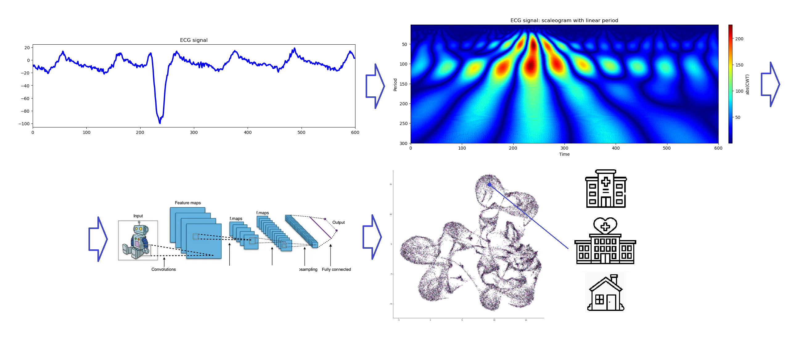

# ECG Analyzer

This is a proof of concept algorithm for quick asessment of whether a patient needs medical care or even specialized cardiological treatment. The program only requires short (~10 beat) ECG signals, as such it can aid decision making in the earliest stages of diagnosis (e.g. ambulance car), alleviating the need for a cardiologist for every case. Without serious optimizitaion this method achieves up to **89.4%** precision for predictions where no further medical care is required. The use of such a program could greatly reduce the number of unnecessary medical examinations, saving time and money for both the patients and the medical professionals.

## Architecture

The algorithm processes the ECG signal through the following steps:
1. A short ECG sample is recorded and provided to the algorithm.
2. The AI transforms the signal to an image via a continous wavelet transform using the morlet or mexican hat type family.
3. The image is fed to a pre-trained deep convolutional neural network that infers the dominant features of the sample.
4. The morphology of the ECG signal is asessed in the high dimensional embedded feature space.
5. The AI suggests the optimal course of action based on the features: whether the patient needs further medical attention and if the patient should immediately be taken to a cardiology clinic.

## Statistics

Here are the performance metrics on the data received from the 2023 European Healthcare Hackathon.

"Best" metrics:

"Best outpatient precision" metrics:

10-fold cross validated metrics for patients under the age of 50:

10-fold cross validated metrics for all patients:

## Further directions, possible improvements

This is only a proof of concept solution, which was succesful in showing how wavelet transforms and deep learning can be used to asess the morphology of an ECG signal. With a little post processing based on this asessment, relevant predictions can be provided regarding a patients need for medical care. However, there are many further directions where such an algorithm could be optimized, some of which we list below:

